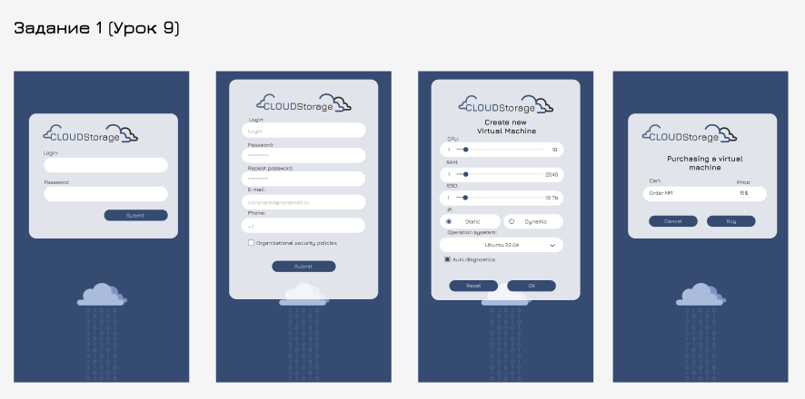
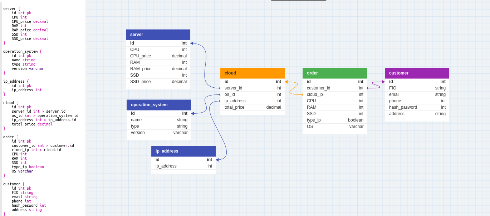
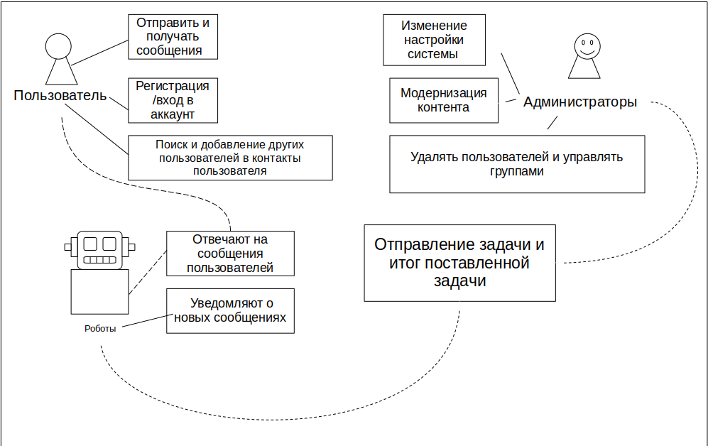
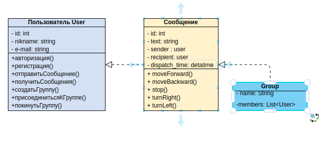
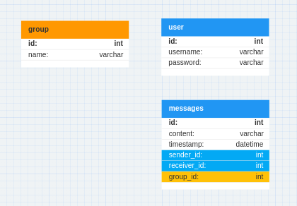

# Задание 1 (Урок 9)
1) Разработать экранные формы интерфейса для заказа ресурсов в облачном сервисе в https://www.figma.com/ или https://app.diagrams.net/.
2) Разработать полную ERD домена в https://www.dbdesigner.net/.

## Ход решения задачи: 
___
Постановка ТЗ: 
Техническое задание: Разработка крайних форм интерфейса для заказа ресурсов в облачном сервисе.

Введение
Целью данного технического задания является разработка крайних форм пользовательского интерфейса (UI) для заказа различных ресурсов в облачных сервисах.

1) Требования к интерфейсу

– Крайние формы должны быть простыми и понятными для пользователей, а также обеспечивать быстрый и легкий доступ к необходимым функциям.

– Внешний вид и дизайн интерфейса должны соответствовать корпоративному стилю компании и быть приятными для глаз.

– Поддержка различных устройств и операционных систем, включая компьютеры, планшеты и смартфоны.

– Возможность использования разных языков для локализации интерфейса.

2) Функциональность крайних форм

– Регистрация и авторизация пользователей.

– Заказ ресурсов (виртуальные машины, хранилища, базы данных и т.д.) с возможностью выбора различных параметров (тип, объем, продолжительность и т.п.).

– Управление заказанными ресурсами (изменение параметров, удаление, просмотр информации и т. д.).

– Отображение информации о текущем состоянии заказанных ресурсов и их использовании.

– Интеграция с другими сервисами и системами (например, платежные системы, CRM и т. п.).

3) Этапы разработки

Ссылки на материалл: 
___

1) Figma: - https://www.figma.com/file/VikZIQs6ev939Ug3FXGF4K/CLOUDStorage?type=design&node-id=0%3A1&mode=design&t=DLSVHYVbaDC8sfiN-1

2) DB Designer:

___

# Задание 2 (Урок 10)
Разработать приложение мессенджера (на выбор desktop/web/mobile). Требуется написать use case диаграмму, выбрать архитектуру для приложения (кратко обосновать выбор), UML и ER диаграммы для выбранной архитектуры. Используя метод персон (не менее 3), описать каких функций не хватает. Пересмотреть UML и ER диаграммы с учетом недостатков. Создать интерфейс в figma для приложения.

Инструменты:

https://www.figma.com/
https://app.diagrams.net/
https://www.dbdesigner.net/

Ход работы: 
---
1) **Платформа:**   
Для разработки приложения мессенджера я выберу мобильную платформу.

2) **Use case диаграмма.**   
Описывающая основные акторы и функциональность приложения мессенджера: 

3) **Архитектура:**  
Выбрана микросервисная архитектура с использованием Docker для контейнеризации, так как она обеспечивает гибкость, масштабируемость и возможность независимого развертывания и обновления сервисов.

4) **UML и ER диаграммы:**
URL:

ER:   

5) **Описание не хватающих функций приложения:*** Возможность групповых чатов и обсуждения тем;
* Создание групповых чатов;
* Возможность редактировать профиль пользователя;
* Интеграция с социальными сетями для авторизации и поиска контактов;
* Шифрование сообщений для обеспечения безопасности;
* Резервное копирование и восстановление данных.

6) **Пересмотр UML и ER диаграммы с учетом недостатков.**  
После пересмотра UML и ER диаграмм, были добавлены новые сущности и связи для поддержки групповых чатов, авторизации через социальные сети и шифрования сообщений. Также было добавлено резервирование данных и восстановление после сбоев.
7) **Интерфейс приложения:**  
Figma - https://www.figma.com/file/VikZIQs6ev939Ug3FXGF4K/CLOUDStorage?type=design&node-id=0%3A1&mode=design&t=DLSVHYVbaDC8sfiN-1

# Задание 3 (Урок 11)
Расписать какие технологие вы бы использовали для реализации архитектуры, заложенной в предыдущей домашней работе. Коротко объяснить свой выбор.

Протокол UAT-тестирования мессенджера должен включать следующие разделы:

Цель тестирования: описание целей и задач тестирования, а также ожидаемых результатов.
Описание приложения: информация о приложении, его функциональности, архитектуре и используемых технологиях.

Тестовые сценарии: список тестов, которые будут проводиться для проверки работоспособности приложения и соответствия его требованиям.

Тестовое окружение: описание оборудования и программного обеспечения, которое будет использоваться для проведения тестирования.

Результаты тестирования: результаты выполнения тестовых сценариев, выявленные ошибки и проблемы, а также предложения по их устранению.

Заключение: выводы о результатах тестирования и рекомендации по улучшению приложения.

Приложения: дополнительные материалы, такие как скриншоты, видео, отчеты об ошибках и т.д.

## Ход работы: ##

Протокол UAT-тестирования мессенджера

**Цель тестирования:** проверить работоспособность приложения, соответствие его функциональности требованиям заказчика и готовность к выпуску на рынок.

**Описание приложения:** Мессенджер представляет собой мобильное приложение, предназначенное для обмена сообщениями, файлами, организации групповых чатов и звонков.

**Архитектура** приложения построена на микросервисной модели, использующей технологию Docker для контейнеризации. В качестве основного сервера используется Amazon AWS, для хранения данных используется база данных PostgreSQL.

**Тестовое окружение:** Тестирование проводится на устройствах под управлением операционной системы Android версии 8.0 и выше. Используются эмуляторы Android Studio и физические устройства Samsung Galaxy S9 и Xiaomi Redmi Note 7.

Тестовые сценарии: 
1. Регистрация и авторизация пользователя
2. Отправка и получение сообщений 
3. Создание группового чата и добавление участников 
4. Изменение настроек приватности и управление контактами 
5. Совершение и прием голосовых и видеозвонков 
6. Резервное копирование истории сообщений и восстановление данных 
7. Работа с уведомлениями и настройка push-уведомлений 
8. Поиск и добавление контактов из социальных сетей 
9. Шифрование и дешифрование сообщений с использованием открытого ключа 
10. Проверка работоспособности системы после аварийного восстановления.